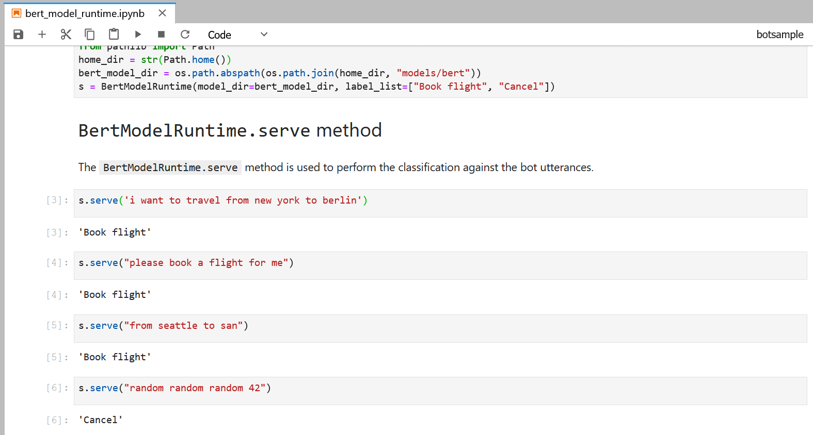
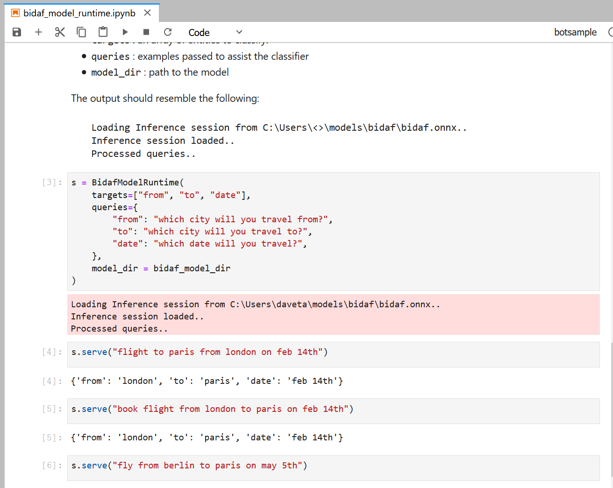

# CoreBot-bert-bidaf

Bot Framework v4 core bot sample demonstrating using open source language models employing the BERT and BiDAF.  This is for demonstration purposes only.  

## Table of Contents
- [Overview](#overview)
- [Terminology](#terminology)
- [Setup](#setup)
- [Model Development](#model-development)
- [Model Runtime Options](#model-runtime-options)
  - [In-Process](#in-process)
  - [Out-of-process to local service](#out-of-process-to-local-service)
  - [Using Docker Containers](#using-docker-containers)


## Overview
This bot has been created using [Bot Framework](https://dev.botframework.com).  It demonstrates the following:
- Train a one layer logistic regression classifier on top of the pretrained BERT model to infer intents.
- Use locally the ONNX BiDAF pre-trained model to infer entities for the scenario, in this case simple flight booking.
- Run the bot with the model runtime in-process to the bot.
- Run the bot with the model runtime external to the bot.

## Terminology
This document uses the following terminology. 
**Model Development**: Model Development broadly covers gathering data, data processing, training/validation/evaluation and testing.  This can also be thought of as model preparation or authoring time.
**Model Runtime**: The built model which can be used to perform inferences against bot utterances.  The model runtime refers to the model and the associated code to perform inferences. The model runtime is used when the bot is running to infer intents and entities.
**Inference**: Applying the bot utterance to a model yields intents and entities.  The intents and entities are the inferences used by the bot.

## Setup

This sample uses the Anaconda environment (which provides Jupyter Lab and other machine learning tools) in order to run.

The following instructions assume using the [Anaconda](<https://www.anaconda.com/>) environment (v4.6.11+). 

Note: Be sure to install the **64-bit** version of Anaconda for the purposes of this tutorial.

### Create and activate virtual environment

In your local folder, open an **Anaconda prompt** and run the following commands:

```bash
cd 101.corebot-bert-bidaf
conda create -n botsample python=3.6 anaconda -y
conda activate botsample # source conda 

# Add extension to handle Jupyter kernel based on the new environemnt.
pip install ipykernel
ipython kernel install --user --name=botsample

# Add extension for visual controls to display correctly
conda install -c conda-forge nodejs -y
jupyter labextension install @jupyter-widgets/jupyterlab-manager
```

From here on out, all CLI interactions should occur within the `botsample` Anaconda virtual environment.

### Install  models package
The `models` package contains source to perform model development support and runtime inferencing using the tuned BERT and BiDAF models.


```bash
# Install Pytorch
conda install -c pytorch pytorch -y  

# Install models package using code in sample
# This will create the python package that contains all the 
# models used in the Jupyter Notebooks and the Bot code.
cd model
pip install -e . # Note the '.' after -e

# Verify packages installed
   # On Windows:
   conda list | findstr "corebot pytorch onnx"

   # On Linux/etc:
   conda list | grep -e corebot -e pytorch -e onnx
```

You should see something like:
```bash
model-corebot101          0.0.1                    dev_0    <develop>
onnx                      1.5.0                    pypi_0    pypi
onnxruntime               0.4.0                    pypi_0    pypi
pytorch                   1.1.0           py3.6_cuda100_cudnn7_1    pytorch
pytorch-pretrained-bert   0.6.2                    pypi_0    pypi
```

## Model Development
Model development in this sample involves building a BERT classifier model and is performed in the Juypter Lab environment.

### Training in Jupyter Lab
Training the model can be performed in Jupyter Lab.
Within the Anaconda shell, launch Jupyter Lab from the sample directory.

```bash
# Start JupyterLab in sample directory
(botsample) 101.corebot-bert-bidaf> jupyter lab

```
#### Click on `notebooks` folder  in the left hand navigation of JupyterLab

<details>
  <summary>Click for screen shot.</summary>
    Selecting notebooks folder in Jupyter
    
</details>

#### Click on `bert_train.ipynb` notebook
If running the first time, you should select the `botsample` environment.
<details>
  <summary>Click for screen shot.</summary>
    Selecting Anaconda `botsample` environment for Jupyter Kernel
    
</details>

#### Train the model

To build the BERT classifier model, run the Jupyterlab Notebok (Run->**Run All Cells**).

<details>
  <summary>Click for screen shot.</summary>
    Selecting Model to build folder
    
</details>

This process may take several minutes.  The built model is placed into a directory that will get packaged with the bot during deployment.   The sample demonstrates using this package in-process to the bot, our of process in a separate host that performs inferences, and within Jupyter Notebooks.

After running the Jupyter Notebook, the output should resemble something like the following:
<details>
  <summary>Click for screen shot.</summary>
    Showing Completed Model Build
    
</details>


#### Test the BERT runtime model classification
Once the model has been built, you can test the model with a separately provided Jupyter Notebook (Run->Run All Cells).
- Within the `notebooks` folder, select the `bert_model_runtime.ipynb` file.
- Run the notebook.

[]

- The output shows intents (`Book flight`, `Cancel`) that will be used by the bot.

- Add additional test cases to see how phrases will be inferenced.

- To modify the training data, update the file below.  The format of this is compatible with the LUIS schema. When done modifying the training data [re-train the model](#train-the-model) before testing.
  `101.corebot-bert-bidaf/model/model_corebot101/bert/training_data/FlightBooking.json`
  
  [Click to edit Training Data.](./model/model_corebot101/bert/training_data/FlightBooking.json)

> **NOTE**: The default file output location for the tuned BERT model is `<home dir>/models/bert`.

### Test the BiDAF runtime model classification
Similarly, you can test the BiDAF model.  Note there is no explicit data processing for the bidaf model.  The entities detected are configured at runtime in the notebook.

[]

> **NOTE**: The default file output location for the BiDAF model is `<home dir>/models/bidaf`.


## Model Runtime Options

The sample can host the model runtime within the bot process or out-of-process in a REST API service.  The following sections demonstrate how to do this on the local machine.  In addition, the sample provides Dockerfiles to run this sample in containers.

### In-process
Within an Anaconda environment (bring up a new Anaconda shell and activate your virtual environment if you would like to continue having JupyterLab running in the original shell), install dependencies for the bot:
```bash
# Install requirements required for the bot
(botsample) 101.corebot-bert-bidaf> pip install -r requirements.txt
```
> **NOTE**: If `requirements.txt` doesn't install, you may have to stop JupyterLab if it's running.

```bash
# Run the bot
(botsample) 101.corebot-bert-bidaf> cd bot
(botsample) 101.corebot-bert-bidaf\bot> python main.py
```


> **NOTE**: If executing `main.py` with Python above doesn't work, try running Flask directly:
>
> ```bash
> # Set FLASK_APP with full path to main.py in the sample directory
> # On linux, use export instead of set.
> (botsample) 101.corebot-bert-bidaf> set FLASK_APP=main.py 
> 
> # Turn on development 
> (botsample) 101.corebot-bert-bidaf> set FLASK_ENV=development
> 
> # Run flask
> (botsample) 101.corebot-bert-bidaf> flask run  
> ```

At this point, you can [test the bot](#testing-the-bot-using-bot-framework-emulator).

### Out-of-process to local service
Sometimes it's helpful to host the model outside the bot's process space and serve inferences from a separate process.  

This section builds on the previous section of [In-process](#in-process).

#### Modify bot configuration for localhost
To call the out-of-process REST API, the bot configuration is modified. Edit the following file:
`101.corebot-bert-bidaf/bot/config.py`

Edit the settings for `USE_MODEL_RUNTIME_SERVICE` and set to `True`.

```python
class DefaultConfig(object):
    """Bot configuration parameters."""
    # TCP port that the bot listens on (default:3978)
    PORT = 3978

    # Azure Application ID (not required if running locally)
    APP_ID = ""
    # Azure Application Password (not required if running locally)
    APP_PASSWORD = ""

    # Determines if the bot calls the models in-proc to the bot or call out of process
    # to the service api using a REST API.
    USE_MODEL_RUNTIME_SERVICE = True
    # Host serving the out-of-process model runtime service api.
    MODEL_RUNTIME_SERVICE_HOST = "localhost"
    # TCP serving the out-of-process model runtime service api.
    MODEL_RUNTIME_SERVICE_PORT = 8880
```
#### Set up model runtime service
Inside a separate Anaconda shell, activate the `botsample` environment, and install the model runtime service.

```bash
# Install requirements required for model runtime service
(botsample) 101.corebot-bert-bidaf> cd bot
(botsample) 101.corebot-bert-bidaf\model_runtime_svc> pip install -e . # Note the dot after the -e switch
```

#### Run model runtime service
To run the model runtime service, execute the following:
```bash
# From 101.corebot-bert-bidaf\model_runtime_svc\model_runtime_svc_corebot101 directory
python main.py 
```
If not already running, create a separate Anaconda shell set to the  `botsample` environment and [run the local bot](#local-in-process) as described above.  If it was already running, ensure [the configuration changes made above](#modify-bot-configuration) are running.

At this point, you can [test the bot](#testing-the-bot-using-bot-framework-emulator).

### Using Docker Containers
This sample also demonstrates using Docker and Docker Compose to run a bot and model runtime service on the local host, that communicate together. 

> **NOTE**:  For Windows: https://hub.docker.com/editions/community/docker-ce-desktop-windows In the configuration dialog make sure the use Linux containers is checked.


#### Modify bot configuration for Docker
To call the out-of-process REST API inside a Docker containerI, the bot configuration is modified. Edit the following file:
`101.corebot-bert-bidaf/bot/config.py`

Ensure that the bot configuration is set to serve model predictions remotely by setting `USE_MODEL_RUNTIME_SERVICE` to `True`.

In addition, modify the `MODEL_RUNTIME_SERVICE_HOST` to `api` (previously `localhost`).  This will allow the `bot` container to properly address the model `model runtime api` service container.

The resulting `config.py`should look like the following:
```python
class DefaultConfig(object):
    """Bot configuration parameters."""
    # TCP port that the bot listens on (default:3978)
    PORT = 3978

    # Azure Application ID (not required if running locally)
    APP_ID = ""
    # Azure Application Password (not required if running locally)
    APP_PASSWORD = ""

    # Determines if the bot calls the models in-proc to the bot or call out of process
    # to the service api using a REST API.
    USE_MODEL_RUNTIME_SERVICE = True
    # Host serving the out-of-process model runtime service api.
    MODEL_RUNTIME_SERVICE_HOST = "api"
    # TCP serving the out-of-process model runtime service api.
    MODEL_RUNTIME_SERVICE_PORT = 8880
```
#### Build the containers

The following command builds both the bot and the model runtime service containers.
```bash
# From 101.corebot-bert-bidaf directory
docker-compose --project-directory . --file docker/docker-compose.yml build
```
> **NOTE**: If you get error code 137, you may need to increase the amount of memory supplied to Docker.

#### Run the containers locally
```bash
# From 101.corebot-bert-bidaf directory
docker-compose --project-directory . --file docker/docker-compose.yml up -d
```
#### Verify
```bash
# From 101.corebot-bert-bidaf directory
docker-compose --project-directory . --file docker/docker-compose.yml logs
docker ps
```
Look at the logs and docker to ensure the containers are running.

## Testing the bot using Bot Framework Emulator

[Bot Framework Emulator](https://github.com/microsoft/botframework-emulator) is a desktop application that allows bot developers to test and debug their bots on localhost or running remotely through a tunnel.

- Install the Bot Framework Emulator version 4.3.0 or greater from [here](https://github.com/Microsoft/BotFramework-Emulator/releases)

### Connect to the bot using Bot Framework Emulator

- Launch Bot Framework Emulator
- File -> Open Bot
- Enter a Bot URL of `http://localhost:3978/api/messages`

### Test the bot
In the emulator, type phrases such as`hello`, `book flight from seattle to miami`, etc


## Further reading

- [Bot Framework Documentation](https://docs.botframework.com)
- [Bot Basics](https://docs.microsoft.com/azure/bot-service/bot-builder-basics?view=azure-bot-service-4.0)
- [Dialogs](https://docs.microsoft.com/azure/bot-service/bot-builder-concept-dialog?view=azure-bot-service-4.0)
- [Gathering Input Using Prompts](https://docs.microsoft.com/azure/bot-service/bot-builder-prompts?view=azure-bot-service-4.0&tabs=csharp)
- [Activity processing](https://docs.microsoft.com/en-us/azure/bot-service/bot-builder-concept-activity-processing?view=azure-bot-service-4.0)
- [Azure Bot Service Introduction](https://docs.microsoft.com/azure/bot-service/bot-service-overview-introduction?view=azure-bot-service-4.0)
- [Azure Bot Service Documentation](https://docs.microsoft.com/azure/bot-service/?view=azure-bot-service-4.0)
- [.NET Core CLI tools](https://docs.microsoft.com/dotnet/core/tools/?tabs=netcore2x)
- [Azure CLI](https://docs.microsoft.com/cli/azure/?view=azure-cli-latest)
- [Azure Portal](https://portal.azure.com)
- [Language Understanding using LUIS](https://docs.microsoft.com/azure/cognitive-services/luis/)
- [Channels and Bot Connector Service](https://docs.microsoft.com/azure/bot-service/bot-concepts?view=azure-bot-service-4.0)
- [Google BERT](https://github.com/google-research/bert)
- [ONNX BiDAF](https://github.com/onnx/models/tree/master/bidaf)